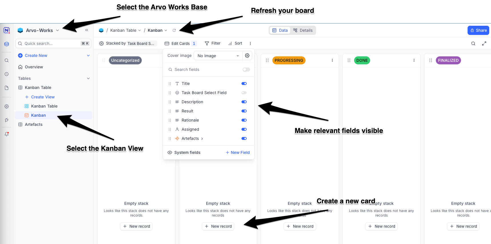
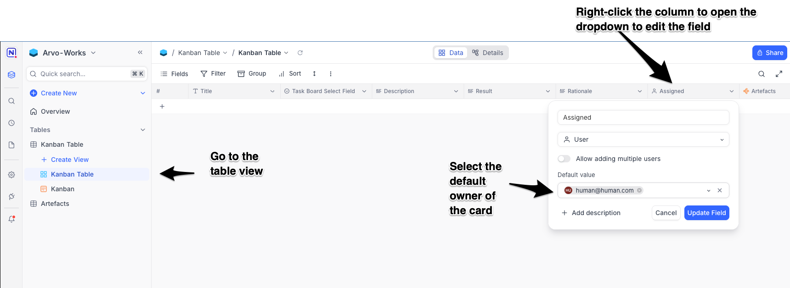
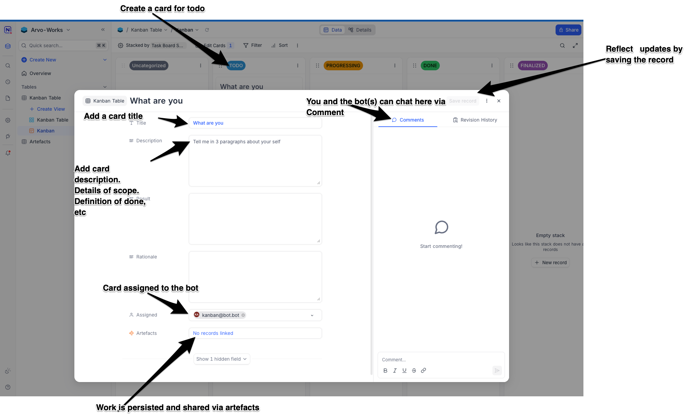
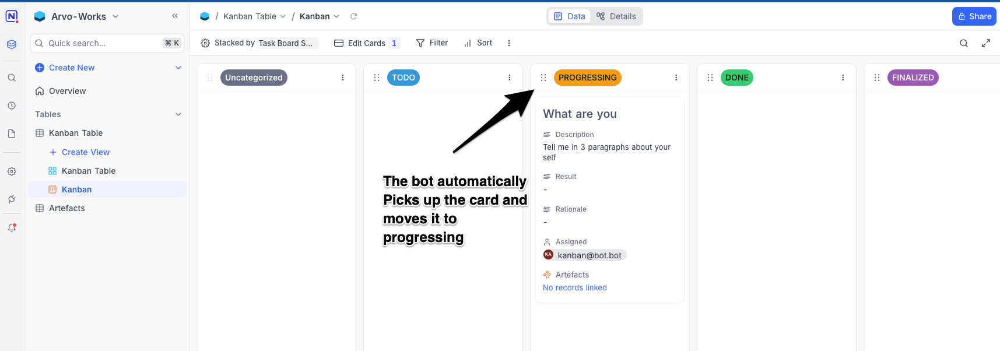
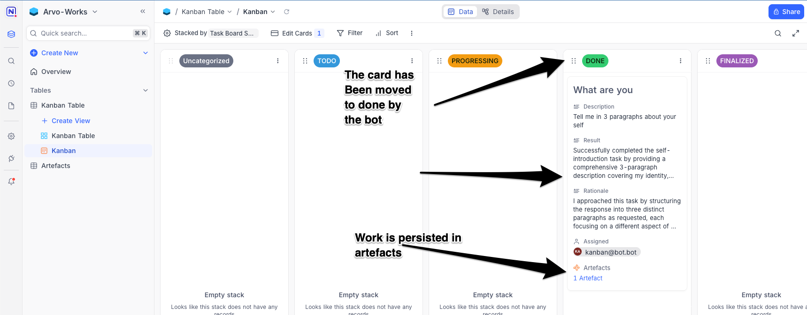
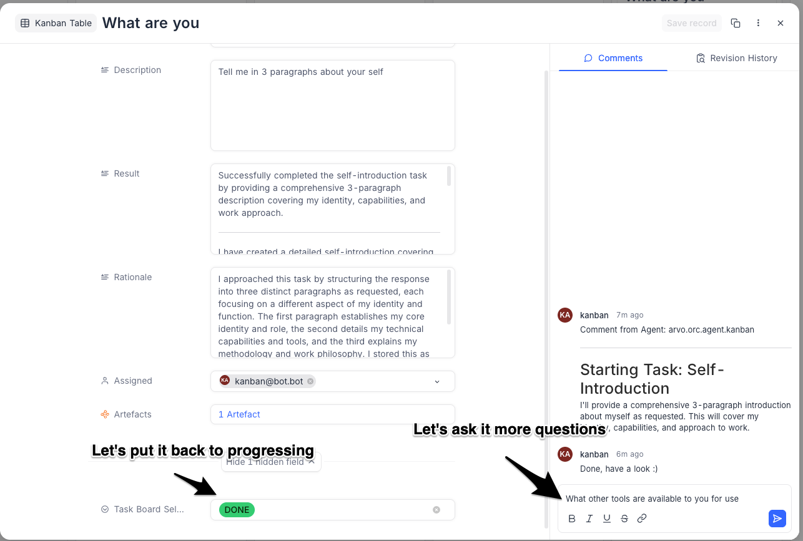
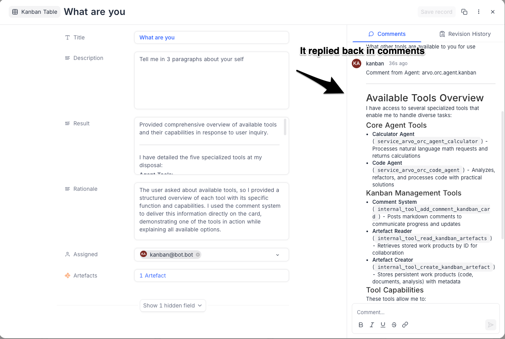
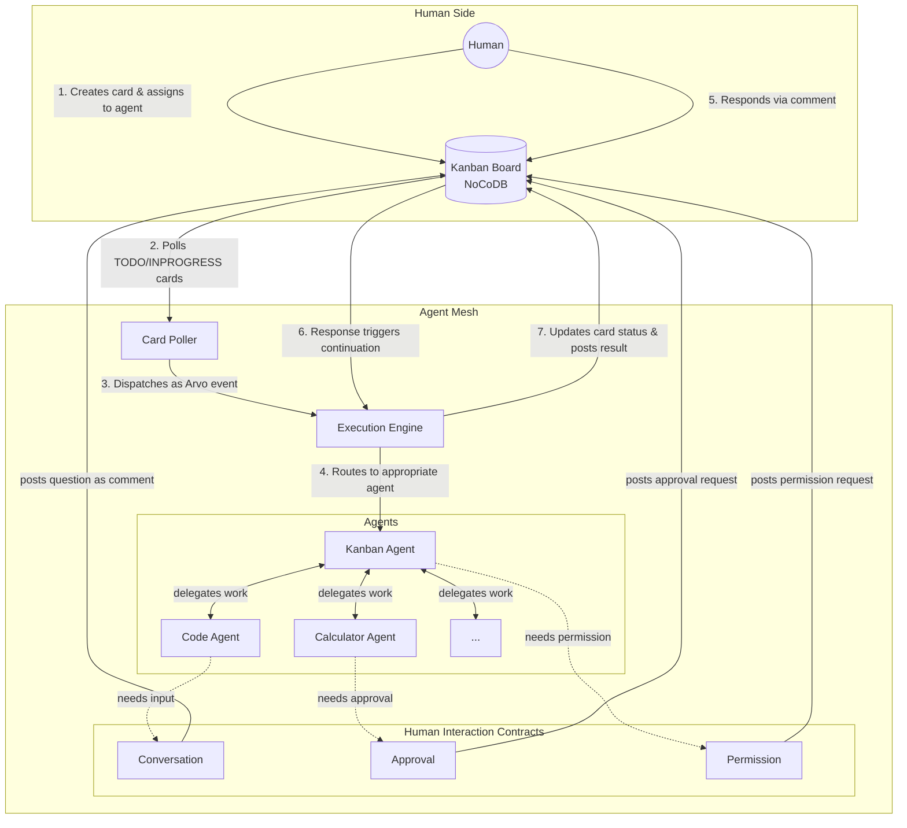

# Arvo Works - A Kanban-based Collaboration Plane between Agent Mesh and Humans.

This project explores *what if Kanban boards could serve as collaboration planes between humans and Agentic Mesh?* As multi-agent systems become more common, I've been thinking about better ways for humans and AI to work together naturally to complete and achieve tasks.

# Demo

[](https://youtu.be/jGRvZp1XcgY)


# Philosophy

The Chat UI for agents requires you to step outside your normal work process - you ask a question, get an answer or notification, then manually integrate that back into your project. This creates friction and breaks the flow of real work. Claude Code and other coding agents fix this by integrating with your IDEs but Agents are not confined to software engineering alone and other use cases, especially, in enterprise Agentic automation tasks human and agent collaboration is paramount and I don't feel that integrated Chat UI can unleash the full potential of Agentic Automation. 


This approach, instead of treating AI as an external tool, treats the agents as native participants in your agile team. The Kanban board becomes a shared workspace where humans and AI agents collaborate on tasks, create persistent work products, and build knowledge together over time. The agents can pause to ask for human's input, request permissions for important decisions, and coordinate with other specialised agents - all within the context of your actual project management process. 


This isn't about replacing human judgment with automation. Let's face it, AI is still not able to fully replace humans - tasks still require oversight, human creativity, and high-level judgement. It's about exploring a way for humans and AI to work as partners, each contributing their unique strengths to achieve better outcomes. I find this approach more natural than the typical "human manages or checks AI tools" or "AI replaces human" paradigm I am see everywhere.


# What This Does

The system integrates autonomous agents directly into Kanban workflow management. Agents can execute complex tasks while keeping you informed through natural conversation, pause mid-execution to request human input or approval, and create persistent work products that build over time. They coordinate with specialized sub-agents for different types of work while maintaining full transparency for all actions taken.

You interact with agents through familiar Kanban cards and comments, making AI assistance feel like working with a capable team member rather than using a separate tool. It's surprisingly natural once you try it.


# Getting Started

Getting started takes a few steps since it relies on setting up NoCoDB tables and the Kanban board. I chose NoCoDB because it gave me a simple API to interact with the board programmatically.

If you'd like me to prioritise creating a setup video for the Kanban board, please raise a GitHub issue.

## Migration (First Time Setup)

1. Start the infrastructure services:
   ```bash
   docker compose up nocodb db jaeger phoenix nginx
   ```

2. Go to http://localhost:6001/ and sign up as a super admin

3. Navigate to http://localhost:6001/dashboard/#/account/tokens and generate a token. Since you are super admin, your token will have super admin rights.

4. In the `backend` folder, create a `.env` file and copy the content from `.env.sample` to this `.env` file. Make sure to have:
   ```bash
   NOCODB_URL=http://localhost:6001
   NOCODB_TOKEN=<The token you just created>
   ```

5. In the `backend` folder, run the migration:
   ```bash
   deno run migrate
   ```
   This will create the tables in NoCoDB and print out the env vars to add, along with instructions for adding tokens for your bot email(s).

## Running the Project

Once migration is complete, stop the infrastructure services and run the full stack with:

```bash
docker compose build
docker compose up
```

You should see logs like this:

```
arvo-backend     | Press Ctrl+C to exit...
arvo-backend     | Detected 0 Card for System to address.
arvo-backend     | Detected 0 Card for System to address.
```

Now, you can navigate to the kanban board (http://localhost:6001/):



Let's setup some meaning full defaults:



Start by creating a todo card for the bot



The bot will pick it up and start working on it. The card creation does not trigger the bot. Rather, the system periodically looks at the board and picks up the cards in TODO and PROGRESSING. The TODO and PROGRESSING are not the states of the system, rather they are the states of work like in any agile board



Once, the task is deemed as done. The bot moves
the card to DONE



Let's ask it more questions



It replied back via commenting. We could have asked it to put it as an artefact as well.



## Application Links

Once the services are running, you can access them through nginx:

- http://localhost:6001/ → NoCoDB (Kanban board interface)
- http://localhost:6001/jaeger → Jaeger (distributed tracing)
- http://localhost:6001/arize → Phoenix (observability)


# How It Works


The agent mesh polls the Kanban board every few seconds, looking for cards in `TODO` or `INPROGRESS` that are assigned to an agent.

When it picks up a card, here's what happens:
- The assigned agent reads the card's task and any existing comments for context
- It starts working and posts comments to keep you updated on progress
- If it needs your input or approval, it pauses and asks—you respond through a comment, and it picks back up
- It can hand off work to other agents in the mesh for different types of tasks
- It can create persistent artifacts (documents, code, analysis) that stay linked to the card for future reference
- When done, it moves the card to `DONE` with a summary of what was completed

What's interesting is that any agent in the mesh can raise questions, request permissions, or ask for review directly through comments. So if an agent handling a specific piece of work needs human input, it surfaces that to you the same way. This makes the entire agent mesh collaborative with you, not just a single orchestrating agent.

You interact with agents the same way you'd interact with a teammate - create a card, assign it, and follow along through comments. The agents coordinate with specialised sub-agents for different types of work, but from your perspective it's just a Kanban card moving through your board.

The result is that AI assistance becomes part of your normal project workflow rather than a separate tool you context-switch into.

# A High-Level Architecture



# Tech Stack

**[Arvo](https://arvo.land)** - The agent mesh is built on Arvo, an event-driven distributed agentic orchestration laye. It provides typed contracts between agents, handles event routing, and makes it straightforward to compose agents that can delegate work to each other. The human interaction contracts (conversation, approval, permission) are also Arvo contracts, which is what allows any agent in the mesh to pause and request human input in a consistent way.

**[NoCoDB](https://nocodb.com)** - I chose NoCoDB as the Kanban interface because it gives me a clean API to interact with the board programmatically while still providing a nice UI for humans. It's essentially a headless database with a spreadsheet/kanban frontend, which makes it perfect for this use case—agents interact via API, humans interact via the UI, and they're looking at the same data.
